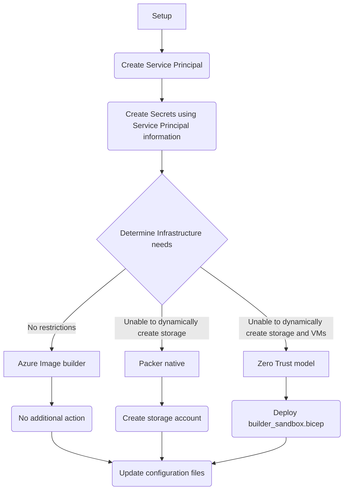
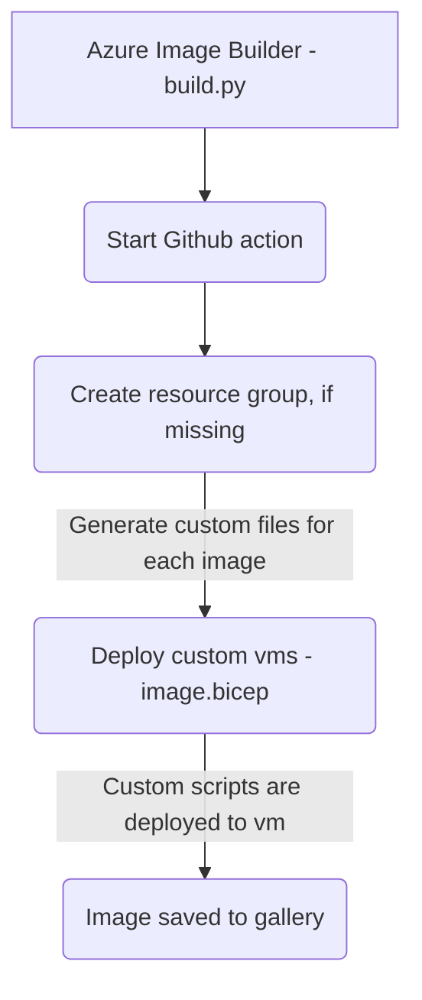
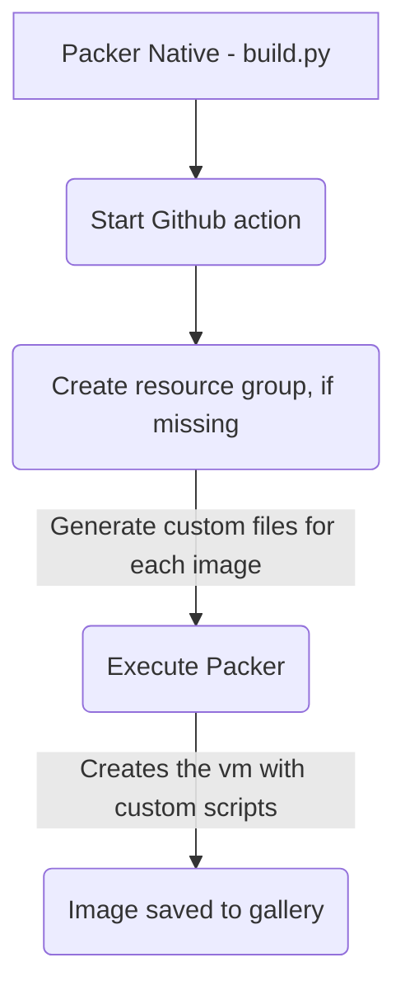
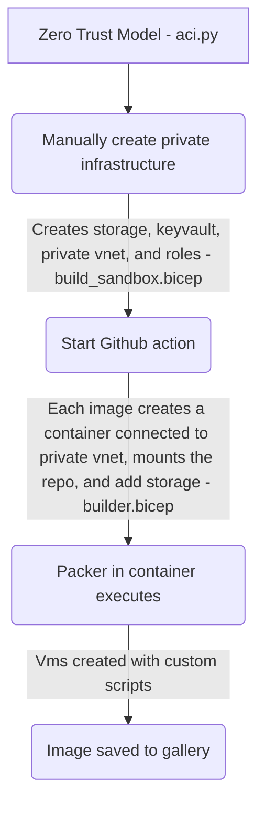

# Custom Dev Box Images

This repo contains a Github action to create custom images to be used with [Microsoft Dev Box](https://techcommunity.microsoft.com/t5/azure-developer-community-blog/introducing-microsoft-dev-box/ba-p/3412063).  It demonstrates how to create custom images with pre-installed software using [Packer](https://www.packer.io/) and shared them via [Azure Compute Gallery](https://docs.microsoft.com/en-us/azure/virtual-machines/shared-image-galleries).

See the [workflow file](.github/workflows/build_images.yml) to see how images are built and deployed.

## Images

[](/../../actions/workflows/build_images.yml)

| Name      | OS                             | Additional Software                                          |
| --------- | ------------------------------ | -------------------------------------------------------------|
| VS2022Box | [Windows 11 Enterprise][win11] | [Visual Studio 2022](https://visualstudio.microsoft.com/vs/) |
| VSCodeBox | [Windows 11 Enterprise][win11] |                                                              |

Use [this form](/../../issues/new?assignees=colbylwilliams&labels=image&template=request_image.yml&title=%5BImage%5D%3A+) to request a new image.

### Preinstalled Software

The following software is installed on all images. Use [this form](/../../issues/new?assignees=colbylwilliams&labels=software&template=request_software.yml&title=%5BSoftware%5D%3A+) to request additional software.

- [Microsoft 365 Apps](https://www.microsoft.com/en-us/microsoft-365/products-apps-services)
- [Visual Studio Code](https://code.visualstudio.com/)
- [Google Chrome](https://www.google.com/chrome/)
- [Firefox](https://www.mozilla.org/en-US/firefox/new/)
- Git
- [GitHub Desktop](https://desktop.github.com/)
- [Postman](https://www.postman.com/)
- [Chocolatey](https://chocolatey.org/)
- [.Net](https://dotnet.microsoft.com/en-us/) (versions 3.1, 5.0, 6.0, 7.0)
- [Python](https://www.python.org/) (version 3.10.5)
- [Azure CLI](https://docs.microsoft.com/en-us/cli/azure/what-is-azure-cli) (2.37.0)
- [Az PowerShell module](https://docs.microsoft.com/en-us/powershell/azure/what-is-azure-powershell)

---
# Overview

# Requirements
- [Service Principal with appropriate access on the subscription.](#service-principal)
- Ability to add resources within the subscription.
# Setup

To get started, [fork][fork] this repository.

_NOTE: The workflow that builds and publishes the images [is only triggered](.github/workflows/build_images.yml#L8-L10) if files the `/images` or `/scripts` folders change.  After completing the steps below, modify any file within those two folders (like changing the `version` in the `image.yml` files) to initiate a build._

## Create Service Principal

The solution requires a Service Principal to provision resources associated with create a new image (VMs, etc.).  See the [Azure Login action docs](create-sp) for instructions on how to create.

**IMPORTANT: Once you create a new Service Principal you must [assign it the following roles in RBAC][assign-rbac]:**:

- **Contributor** on the subscription used to provision resources, **OR**
- **Owner** on a specific (existing) resource group (see [Resource Group Usage](#resource-group-usage) below) and **Contributor** on the [Azure Compute Gallery][az-gallery] (and its resource group)

### Secrets
In your fork create three new [repository secrets](repo-secret)[...](https://docs.github.com/en/actions/security-guides/encrypted-secrets) with a value that contains credentials for the service principal created above. For details on how to create these credentials, see the [Azure Login action docs](create-sp).

Example:

```sh
az ad sp create-for-rbac --role contributor --scopes /subscriptions/<GUID> -n MyUniqueName
```

output:

```json
{
  "appId": "<GUID>",
  "displayName": "<STRING>",
  "password": "<STRING>",
  "tenant": "<GUID>"  
}
```
#### `AZURE_CLIENT_ID`
Set to the appId value from the output above.
#### `AZURE_CLIENT_SECRET`
Set to the password value from the output above.
#### `AZURE_TENANT_ID`
Set to the tenant value from the output above.

## Determine infrastructure access
Depending on your needs there are three different ways to setup the image builder. Here are the details on each configuration. The different configurations are for specific requirements in the Azure subscription.
- For the Azure Image Builder
- Packer Native
- Zero Trust

### Azure Image builder (AIB)
Simplest to setup, but requires create Azure resources like storage accounts, and virtual machines within the AIB.  Policies on the subscription may not allow or restrict these types of resources, if so try the Packer native approach. 

**Azure Image Builder Workflow**


#### Required Configuration Azure Image Builder
##### Azure Compute Gallery - Gallery.yml

Open the [`gallery.yml`](gallery.yml) file in the root of the repository and update following properties to match your [Azure Compute Gallery][az-gallery]:

- [`name`](gallery.yml#L1) - the name of your Azure Compute Gallery
- [`resourceGroup`](gallery.yml#L2) - The resource group that contains your Azure Compute Gallery

Example:

```yaml
name: MyGallery
resourceGroup: MyGallery-RG
```

##### Images - Images.yml
 
Open the [images.yml](images/images.yml) file in the images folder and update the following properties to match your configuration.

- [`builder`](images/images.yml#L31) - the type of builder `azure`.
- [`buildResourceGroup`](images/images.yml#37) - optional - the existing resource group name.

Example:

```yaml
builder: azure
buildResourceGroup: MyCurrentResourceGroup
```

### Packer native
This configuration requires more initial setup of creating the storage account before the action.  

**Packer Native Workflow**


#### Required Configuration Packer Native
##### Azure Compute Gallery - Gallery.yml

Open the [`gallery.yml`](gallery.yml) file in the root of the repository and update following properties to match your [Azure Compute Gallery][az-gallery]:

- [`name`](gallery.yml#L1) - the name of your Azure Compute Gallery
- [`resourceGroup`](gallery.yml#L2) - The resource group that contains your Azure Compute Gallery

Example:

```yaml
name: MyGallery
resourceGroup: MyGallery-RG
```

##### Images - Images.yml
 
Open the [images.yml](images/images.yml) file in the images folder and update the following properties to match your configuration.

- [`builder`](images/images.yml#L31) - the type of builder type `Packer`.
- [`buildResourceGroup`](images/images.yml#37) - optional - the existing resource group name.

Example:

```yaml
builder: packer
buildResourceGroup: MyCurrentResourceGroup
```


### Zero trust model
This configuration is designed for those subscriptions in a highly restricted subscription.  This can be setup using the [builder_sandbox.bicep](builder\templates\builder_sandbox.bicep)


**Zero Trust Workflow**


#### Required Configuration Zero Trust 
##### Azure Compute Gallery - Gallery.yml

Open the [`gallery.yml`](gallery.yml) file in the root of the repository and update following properties to match your [Azure Compute Gallery][az-gallery]:

- [`name`](gallery.yml#L1) - the name of your Azure Compute Gallery
- [`resourceGroup`](gallery.yml#L2) - The resource group that contains your Azure Compute Gallery

Example:

```yaml
name: MyGallery
resourceGroup: MyGallery-RG
```

##### Images - Images.yml
 
Open the [images.yml](images/images.yml) file in the images folder and update the following properties to match your configuration.

- [`builder`](images/images.yml#L31) - the type of builder type `Packer`.
- [`buildResourceGroup`](images/images.yml#L37) - the existing resource group name.
- [`keyVault`](images/images.yml#L38) - KeyVault
- [`virtualNetwork`](images/images.yml#L39) - Virtual network resource id.
- [`virtualNetworkResourceGroup`](images/images.yml#L41) - Resource group where the virtual network exists.
- [`subscription`](images/images.yml#L42) - Subscription id.

Example:

```yaml
builder: packer
buildResourceGroup: MyBuildRG
keyVault: mykeyvaultgenerated
virtualNetwork: /subscriptions/00000000-0000-0000-0000-000000000000/resourceGroups/myvnetresourcegroup/providers/Microsoft.Network/virtualNetworks/myvnet
virtualNetworkResourceGroup: myvnetresourcegroup
subscription: 00000000-0000-0000-0000-000000000000
```
##### Action - Build_Images.yml
Open the ['build_images.yml](.github/workflows/build_images.yml) file in the .github folder and update the properties to match your configuration.  Comment or remove the Prepare and Build jobs and uncomment the BuildContainers job.

- [`STORAGE_ACCOUNT`](.github/workflows/build_images.yml#L23) - Storage account name
- [`SUBNET_ID`](.github/workflows/build_images.yml#L24) - Virtual network subnet id

Example:

```yml
STORAGE_ACCOUNT: contosoimagesstorage
SUBNET_ID: /subscriptions/00000000-0000-0000-0000-000000000000/resourceGroups/Contoso-Images/providers/Microsoft.Network/virtualNetworks/contoso-images-vnet/subnets/builders
```

## Additional information
### Resource Groups

This solution uses either Packer's [Azure builder][az-builder] which can either provision resources into a new resource group that it controls (default) or an existing one. The advantage of using a packer defined resource group is that failed resource cleanup is easier because you can simply remove the entire resource group, however this means that the provided credentials must have permission to create and remove resource groups. By using an existing resource group you can scope the provided credentials to just this group, however failed builds are more likely to leave unused artifacts.

To use an existing resource group you **must** provide a value for `buildResourceGroup` in the images `image.yml` file.


# Contributing

This project welcomes contributions and suggestions.  Most contributions require you to agree to a
Contributor License Agreement (CLA) declaring that you have the right to, and actually do, grant us
the rights to use your contribution. For details, visit <https://cla.opensource.microsoft.com>.

When you submit a pull request, a CLA bot will automatically determine whether you need to provide
a CLA and decorate the PR appropriately (e.g., status check, comment). Simply follow the instructions
provided by the bot. You will only need to do this once across all repos using our CLA.

This project has adopted the [Microsoft Open Source Code of Conduct](https://opensource.microsoft.com/codeofconduct/).
For more information see the [Code of Conduct FAQ](https://opensource.microsoft.com/codeofconduct/faq/) or
contact [opencode@microsoft.com](mailto:opencode@microsoft.com) with any additional questions or comments.

[win11]:https://www.microsoft.com/en-us/microsoft-365/windows/windows-11-enterprise
[dtl]:https://www.packer.io/plugins/provisioners/azure
[fork]:https://docs.github.com/en/get-started/quickstart/fork-a-repo
[az-builder]:https://www.packer.io/plugins/builders/azure/arm
[az-gallery]:https://docs.microsoft.com/en-us/azure/virtual-machines/shared-image-galleries?tabs=azure-cli
[create-sp]:https://github.com/Azure/login#configure-deployment-credentials
[repo-secret]:https://docs.github.com/en/actions/reference/encrypted-secrets#creating-encrypted-secrets-for-a-repository
[assign-rbac]:https://docs.microsoft.com/en-us/azure/role-based-access-control/role-assignments-portal?tabs=current
